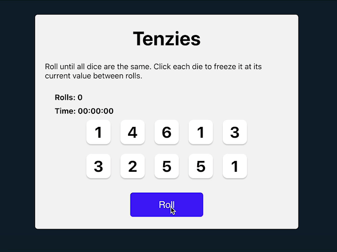

# Tenzies
This is a simple react game using create-react-app for the game tenzies.

## How It's Made:

**Tech used:** HTML, CSS, JavaScript, React

This app was made using react concepts such as useState and useEffect to keep track of the dice numbers, and the game state and other things. It used javascript algorithms to handle the game's logic, and pure css for the styling.

## Optimizations

In the future, I would like to add the feature to save the time and rolls to localStorage to keep track of the player's best time and score. Another feature I would like to add is to replace the numbers on the die with actual dots to look like dice.

## Lessons Learned:

This is my first react project and taught me a lot about how to use the fundamentals of react.

